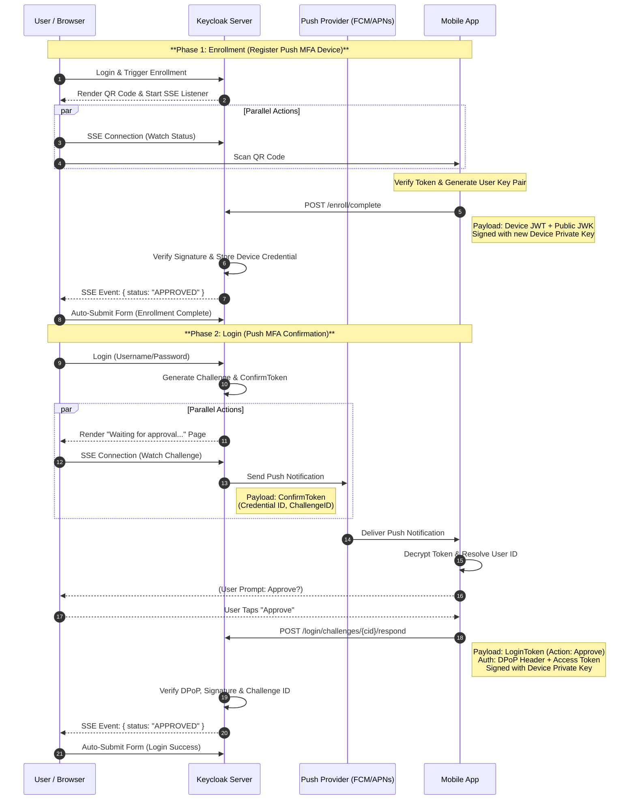

# Keycloak Push MFA Extension

A Keycloak extension that adds push-based multi-factor authentication, similar to passkey primitives.

## Quick Start

### Using Maven (recommended)

Add the dependency to your project:

```xml
<dependency>
    <groupId>de.arbeitsagentur.opdt</groupId>
    <artifactId>keycloak-push-mfa-extension</artifactId>
    <version>1.3.1</version>
</dependency>
```

Copy the JAR to Keycloak's `providers/` directory and restart Keycloak.

### Building from Source

```bash
# Build the provider
mvn -DskipTests package

# Run Keycloak with the demo realm
docker compose up
```

- **Keycloak Admin Console:** http://localhost:8080 (login: `admin` / `admin`)
- **Demo Realm:** `demo` with test user `test` / `test`
- **Demo Configuration:** See `config/demo-realm.json` for a working example

## Introduction

This project extends Keycloak with a push-style second factor that mimics passkey primitives. After initial enrollment, the mobile app never receives the real user identifier from Keycloak; instead, it works with a credential id that only the app can map back to the real user. Everything is implemented with standard Keycloak SPIs plus a small JAX-RS resource exposed under `/realms/<realm>/push-mfa`.

## High Level Flow



## Documentation

| Document | Description |
|----------|-------------|
| [Setup Guide](docs/setup.md) | Step-by-step configuration instructions and Keycloak concepts |
| [Flow Details](docs/flow-details.md) | Technical details of enrollment, login, SSE, and DPoP authentication |
| [API Reference](docs/api-reference.md) | REST endpoints for mobile apps |
| [Configuration](docs/configuration.md) | All configuration options reference |
| [App Implementation](docs/app-implementation.md) | Guide for mobile app developers |
| [SPI Reference](docs/spi-reference.md) | Push notification, event, and rate limiting SPIs |
| [UI Customization](docs/ui-customization.md) | Theme and template customization |
| [Security](docs/security.md) | Security model and mobile app obligations |
| [Mobile Mock](docs/mobile-mock.md) | Testing without a real mobile app |
| [Troubleshooting](docs/troubleshooting.md) | Common issues and solutions |
